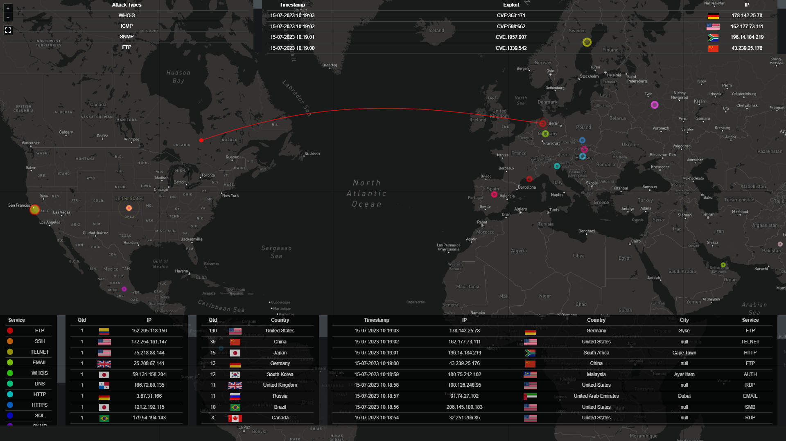

<h1 align="center">
  Honey Map
</h1>

<h3 align="center">
  Honeypot Attack Map Visualization
</h3>

<p align="center">
  This project visualizes cyber attacks against an organization through an immersive geo-visualized threat map.
</p>



- [Features](#features)
- [Log Parsing and Normalization](#log-parsing-and-normalization)
- [Getting Started](#getting-started)
- [License](#license)

## Features

- **Interactive World Map Visualization:** Utilizes D3.js, Leaflet.js, and Mapbox to render an interactive world map, providing a visual representation of GeoIP attack data.
- **IP Origin Tracking:** Includes a table that dynamically tracks and displays the quantity and IP addresses of the origins of attacks.
- **Country Origin Tracking:** Features another table that tracks and displays the quantity and countries of the origins of attacks.
- **Responsive Design:** The application is designed with a responsive layout, ensuring compatibility and usability across various screen sizes and devices.
- **Environment Variables:** The project uses environment variables for configuration, providing flexibility and security for different deployment scenarios.
- **Automated Setup:** The project includes a setup script that automates the process of cloning the repository, installing dependencies, and configuring the database, making it easy for anyone to get started.
- **Easy Start and Stop:** The project provides a start script that simplifies the process of starting the necessary services, including the Redis server, DataServer, and MapServer. Stopping the services is also straightforward, making it easy to manage the application.
- **Automated Data Generation:** The project includes a script for generating random syslog data, simulating real-world data input for testing and demonstration purposes.

## Log Parsing and Normalization

This program needs to read and understand the logs from different devices that
send syslog messages. However, these devices may have different ways of
formatting their logs, so you need to adjust the program to match them. To do
this you have to customize `parse_syslog` function in `data_server.py` file. A
simpler way to do this is to use a security information and event management
system (SIEM) that can make the logs more consistent and easier to parse.

To use a SIEM, you need to follow these steps:

1. Send all the syslog messages from your devices to the SIEM.
2. Configure the SIEM to normalize the logs, which means making them follow a common format and structure.
3. Send the normalized logs from the SIEM to the machine that runs this program, which can be any Linux machine with syslog-ng installed. The program will then be able to parse the logs and display the attacks on the map.

## Getting Started

Follow these steps to download, setup, and manage the project:

**Fetch the Setup Script:** Download the `setup.sh` script from the project repository. You can do this using wget or curl:

```bash
wget https://raw.githubusercontent.com/AminZibayi/HoneyMap/master/setup.sh
# or
curl -O https://raw.githubusercontent.com/AminZibayi/HoneyMap/master/setup.sh
```

**Run the Setup Script:** This will install all necessary dependencies and set up the project for you.

```bash
./setup.sh
```

**Adjust the Environment Variables:** After running the setup script, you may
need to adjust some environment variables based on your specific needs or system
configuration. You can use the provided `.env.example `file as a template. Rename
it to .env and adjust the variables as needed.

**Start the Project:** Use the `start.sh` script to start the project.

```bash
./start.sh
```

_Note:_ This script starts a random syslog generator script that creates
simulated attack data. In production environment the following line must be
omitted from the script:

```bash
# Start the Fake Syslog Gen Script
nohup python3 ./random_syslog_gen.py &
```

**Stop the Project:** You can stop the project by running the `stop.sh` script.

```bash
./stop.sh
```

## License

[The MIT License](https://github.com/AminZibayi/Corporio/blob/master/LICENSE)
